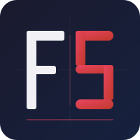

# cotel — Claude Code Telemetry

One Docker container. OTLP ingest on `:4318`, interactive analytics dashboard on `:8080`. No cloud dependencies, no sign-up.


## What you get

- **Overview dashboard** — KPI cards for sessions, unique users, total cost, and token counts (30-day window), with per-user filter across all charts
- **Sessions** — live table of every Claude Code session with user, model, duration, cost, and status (OK / ERROR); search by user and click any user to filter the table to their sessions
- **History** — time-series and daily-activity heatmaps for sessions and token spend over time
- **Costs** — cumulative spend chart + breakdown table by model
- **Tools** — call counts, average duration, and error rate per tool (`Bash`, `Read`, `Edit`, …)
- **Models** — token and cost breakdown across all Claude model variants
- **Users** — named users, API tokens, search, pagination, and click-through to per-user analytics
- **Setup** — step-by-step onboarding guide with copy-paste `settings.json` snippets pre-filled with your ingest URL and token
- **Export / Import** — download all data as a versioned ZIP/CSV archive; restore it on a fresh instance
- **Cloudflare Tunnel** — publish cotel over HTTPS with a single env var; bearer-token auth for OTLP, Zero Trust for the dashboard

## Quick start

```bash
docker run -d \
  --name cotel \
  -p 4318:4318 \
  -p 8080:8080 \
  -v cotel-data:/data \
  ghcr.io/flopsstuff/cotel:latest
```

> **Available tags:** `:latest` and `:0.2` (current release), `:0.x.y` (patch), `:main` (tip of main branch).

Open **http://localhost:8080** → **Setup** for the guided onboarding.

## Point Claude Code at cotel

Add to your `~/.claude/settings.json`:

```json
{
  "env": {
    "CLAUDE_CODE_ENABLE_TELEMETRY": "1",
    "CLAUDE_CODE_ENHANCED_TELEMETRY_BETA": "1",
    "OTEL_TRACES_EXPORTER": "otlp",
    "OTEL_EXPORTER_OTLP_PROTOCOL": "http/json",
    "OTEL_EXPORTER_OTLP_TRACES_ENDPOINT": "http://localhost:4318/v1/traces"
  }
}
```

Restart Claude Code. Telemetry starts flowing immediately.

## Users and authentication

cotel ships with token-based authentication for OTLP ingest. Tokens are tied to named users.

Open the dashboard → **Users** (people icon in the sidebar) → **Add user**. Give the user a name (e.g. the machine or agent name sending telemetry). Copy the token — it is always accessible from the Users table. Rotating or deleting a user revokes its token immediately.

By default, cotel accepts spans without an `Authorization` header (allow-anonymous mode). To enforce strict auth: open **Setup** → **Settings** tab → disable **Allow anonymous OTLP**. Requests without a valid token then receive `401 Unauthorized`.

See **[docs/operations/users-and-auth.md](docs/operations/users-and-auth.md)** for the full guide: multi-user setup, token rotation, and security considerations.

## Publishing with Cloudflare

Use [Cloudflare Tunnel](https://developers.cloudflare.com/cloudflare-one/connections/connect-networks/) to expose cotel over HTTPS without opening inbound ports. The dashboard is protected by Cloudflare Zero Trust; OTLP ingest is protected by a bearer token you create in the cotel Users page.

### Prerequisites

- A Cloudflare account (free tier is sufficient)
- A domain managed by Cloudflare DNS
- [Cloudflare Zero Trust](https://one.dash.cloudflare.com/) enabled on your account (free for up to 50 users)

### 1. Create a tunnel

1. Go to **Cloudflare Zero Trust → Networks → Tunnels → Add a tunnel**.
2. Choose **Cloudflared**, name the tunnel (e.g. `cotel`), and click **Save tunnel**.
3. Copy the tunnel token shown on the next screen — you will use it as `CLOUDFLARE_TUNNEL_TOKEN`.

### 2. Configure public hostnames

In the tunnel's **Public Hostnames** tab, add two entries:

| Subdomain | Domain | Service |
|-----------|--------|---------|
| `cotel` | `yourdomain.com` | `http://localhost:8080` |
| `cotel-ingest` | `yourdomain.com` | `http://localhost:4318` |

Replace the subdomains and domain with your own values.

### 3. Protect the dashboard with Zero Trust

In **Zero Trust → Access → Applications**, create a **Self-hosted** application for your dashboard hostname (e.g. `https://cotel.yourdomain.com`). Add an access policy — for example "Allow email ending in `@yourcompany.com`".

Leave the OTLP ingest hostname (`cotel-ingest.yourdomain.com`) unprotected in Zero Trust. Authentication for ingest is handled by the cotel bearer token instead.

### 4. Start cotel with the tunnel token

Pass `CLOUDFLARE_TUNNEL_TOKEN` when running the container:

```bash
docker run -d \
  --name cotel \
  -v cotel-data:/data \
  -e CLOUDFLARE_TUNNEL_TOKEN=<your-tunnel-token> \
  ghcr.io/flopsstuff/cotel:latest
```

No `-p` flags are needed — Cloudflare Tunnel uses outbound connections only.

### 5. Create an agent token

Open your dashboard URL (e.g. `https://cotel.yourdomain.com`), go to **Users** in the sidebar, and click **Add user**. Give it a name (e.g. the agent's hostname or machine name) and copy the token.

### 6. Configure Claude Code

Add to your `~/.claude/settings.json`:

```json
{
  "env": {
    "CLAUDE_CODE_ENABLE_TELEMETRY": "1",
    "CLAUDE_CODE_ENHANCED_TELEMETRY_BETA": "1",
    "OTEL_TRACES_EXPORTER": "otlp",
    "OTEL_EXPORTER_OTLP_PROTOCOL": "http/json",
    "OTEL_EXPORTER_OTLP_TRACES_ENDPOINT": "https://cotel-ingest.yourdomain.com/v1/traces",
    "OTEL_EXPORTER_OTLP_HEADERS": "Authorization=Bearer cotel_<your-token>"
  }
}
```

Replace `cotel-ingest.yourdomain.com` with your actual OTLP hostname, and `cotel_<your-token>` with the token you copied above. Restart Claude Code to apply the changes.

> **Token enforcement:** cotel accepts anonymous spans until the first user with a token is created. Once any token exists, every OTLP request must carry a valid `Authorization: Bearer cotel_...` header — unless you explicitly re-enable Allow anonymous OTLP in Setup → Settings.

## Ports

| Port | Purpose |
|------|---------|
| 4318 | OTLP/HTTP trace ingest (`POST /v1/traces`) |
| 8080 | Analytics dashboard |

> **HTTP-only:** cotel speaks OTLP/HTTP (`application/x-protobuf` and `application/json`). There is no gRPC listener on port 4317. If spans are silently dropped, ensure `OTEL_EXPORTER_OTLP_PROTOCOL=http/json` (or `http/protobuf`) is set — the OTel SDK default is `grpc`, which will fail against cotel.

## Data

Data lives in the named volume (`cotel-data`) at `/data/cotel.duckdb`. You can query it directly:

```bash
docker run --rm -v cotel-data:/data ubuntu \
  duckdb /data/cotel.duckdb "SELECT model, COUNT(*) FROM spans GROUP BY model"
```

## Retention defaults

| Tier | Period | Storage |
|------|--------|---------|
| Raw spans | 30 days | `spans` table |
| Daily aggregates | 90 days | `daily_usage` table |

Override with environment variables:

| Variable | Default | Description |
|----------|---------|-------------|
| `COTEL_RETENTION_RAW_DAYS` | `30` | Delete raw spans older than this many days |
| `COTEL_RETENTION_AGGREGATE_DAYS` | `90` | Delete daily aggregate rows older than this many days |
| `COTEL_RETENTION_INTERVAL` | `6h` | How often the retention worker runs (Go duration string, e.g. `1h`, `30m`) |

## Development

```bash
# Build locally
docker compose build

# Run locally
docker compose up

# Run tests
go test ./...
```

## Environment variables

| Variable | Default | Description |
|----------|---------|-------------|
| `COTEL_DB_PATH` | `/data/cotel.duckdb` | DuckDB file path |
| `COTEL_INGEST_ADDR` | `:4318` | Ingest listener address |
| `COTEL_DASH_ADDR` | `:8080` | Dashboard listener address |
| `COTEL_RETENTION_RAW_DAYS` | `30` | Raw span retention in days |
| `COTEL_RETENTION_AGGREGATE_DAYS` | `90` | Daily aggregate retention in days |
| `COTEL_RETENTION_INTERVAL` | `6h` | Retention worker tick interval (Go duration) |
| `CLOUDFLARE_TUNNEL_TOKEN` | _(unset)_ | When set, starts `cloudflared tunnel run` before cotel; enables public HTTPS access via Cloudflare Tunnel |
| `COTEL_PUBLIC_INGEST_URL` | _(unset)_ | Absolute `http`/`https` URL of the public OTLP ingest endpoint (e.g. `https://cotel-ingest.yourdomain.com`). When set, the Setup page substitutes this URL into the copy-paste Claude Code snippets. |

## Maintenance commands

### Cost backfill

If the pricing table was corrected after spans were already ingested, you can recalculate `cost_usd`
for all historical spans using the current pricing rates.

**Step 1 — dry-run (safe, no writes):**

```bash
docker exec cotel-cotel-1 /usr/local/bin/cotel --backfill-cost
```

Prints a per-model table showing old vs new cost and the total delta, without touching the database.
Spans with an unknown or empty model are listed separately and left untouched.

**Step 2 — apply (after reviewing the dry-run output):**

```bash
docker exec cotel-cotel-1 /usr/local/bin/cotel --backfill-cost-apply
```

Updates `cost_usd` on every known-model span and re-aggregates `daily_usage`. Spans with unknown
or empty models are skipped. The operation is idempotent — running it twice yields the same result.

> **Note:** The server holds an exclusive DuckDB write lock, so the backfill runs *inside* the
> container via `docker exec` against the already-open database connection pool. No container
> restart is required.

## Architecture

```
Claude Code  →  OTLP/HTTP (port 4318)  →  ingest handler
                                           ↓
                                        DuckDB (named volume)
                                           ↓
dashboard (port 8080)  ←─────────────────┘
```

Single Go binary, single DuckDB file, single named volume. No sidecars.
